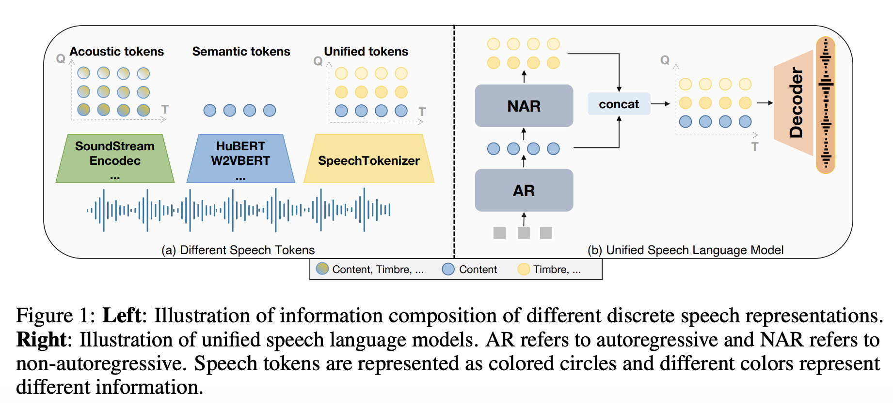
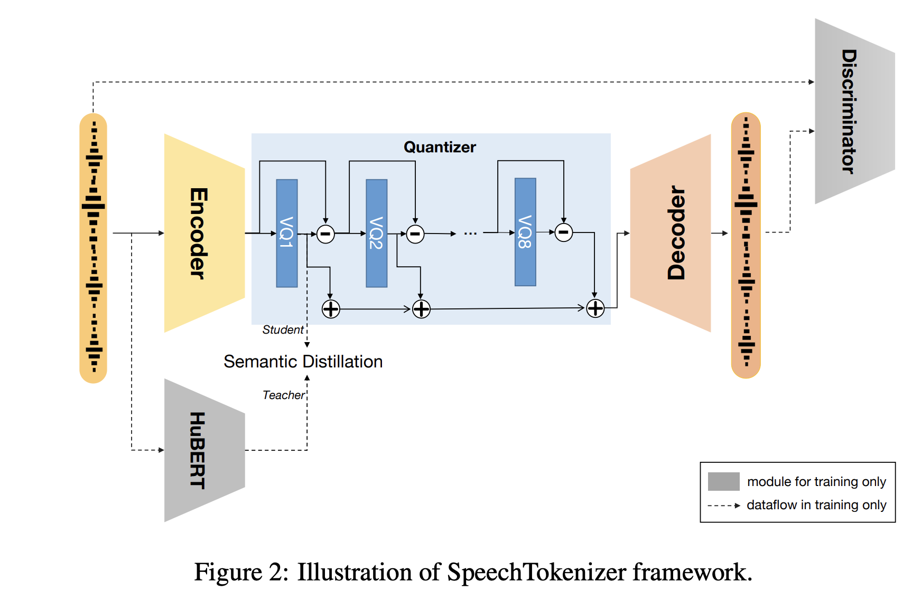
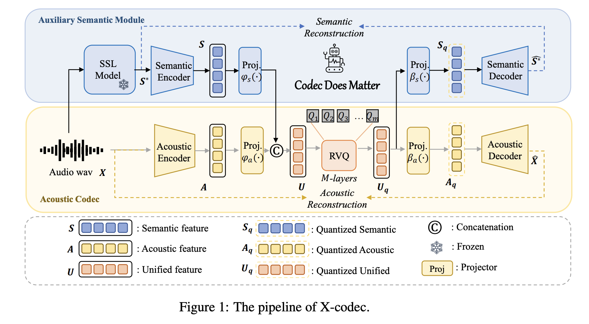
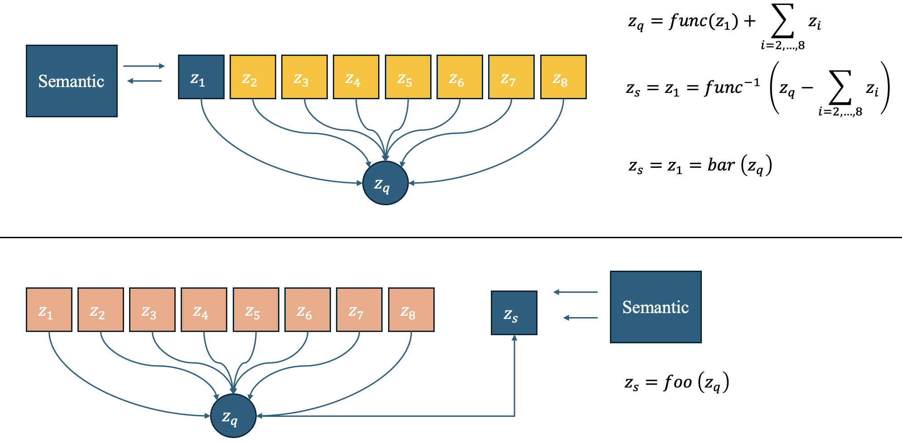

# Discrete Speech Representation with Semantic Fusion

## 1. Prologue

Purely acoustic reconstruction tokens (e.g., from EnCodec) focus on signal fidelity, encoding excessive paralinguistic details (timbre, noise, room impulse) while diluting linguistic content. This creates a significant **Modality Gap** when aligned with text, necessitating the injection of semantic information from Self-Supervised Learning (SSL) models (e.g., HuBERT/W2V-BERT).

The necessity of semantic fusion stems from three key perspectives:

- **The LLM-based TTS Perspective**: Unlike traditional TTS (Acoustic Model + Vocoder), LLM-based TTS treats speech synthesis as a *Language Modeling* task. If the target speech tokens are dominated by acoustic noise rather than linguistic structure, the LLM struggles to learn the mapping from Text to Speech, leading to high Word Error Rates (WER) and content hallucinations.
- **Audio-Text Semantic Alignment**: Text is a purely semantic, discrete signal, whereas audio is a dense, continuous signal containing both content and style. Semantic tokens act as a **Bridge**, aligning the audio representation space closer to the text embedding space. This alignment significantly reduces the difficulty of cross-modal generation.
- **The LLM Modeling Perspective**: LLMs are inherently designed to model semantic dependencies and logical flow. Acoustic tokens have high entropy and variance (the same word spoken twice results in different acoustic tokens). By distilling semantic information, we reduce the aleatoric uncertainty in the target sequence, allowing the LLM to focus on predicting "what to say" (Content) before determining "how to say it" (Timbre/Prosody).

## 2. Representative Works

### 2.1 [SpeechTokenizer]([[2308.16692] SpeechTokenizer: Unified Speech Tokenizer for Speech Large Language Models](https://arxiv.org/abs/2308.16692))

> SpeechTokenizer adopts the Encoder-Decoder architecture with residual
> vector quantization (RVQ). Unifying semantic and acoustic tokens, SpeechTokenizer disentangles different aspects of speech information hierarchically across different RVQ layers.



Briefly speaking, ST firstly introduced semantic distillation into RVQ

* RVQ-based structure, implementation inherited from Encodec

* Design semantic adaptor for semantic loss calculation

Build upon Encodec, the design philosophy is simple:



#### Speech Reconstruction Comparison

|                 | **Objective** |             | **Subjective** |
|:--------------- |:-------------:|:-----------:|:--------------:|
| **Tokenizer**   | **WER↓**      | **VISQOL↑** | **MUSHRA↑**    |
| Groundtruth     | 4.58          | -           | 91.46          |
| EnCodec         | 5.11          | 4.37        | 79.86          |
| SpeechTokenizer | 5.04          | 4.30        | 90.55          |

Besides, the authors experimented on the Voice Conversion Task w/wo the first RVQ layer. 

> **SpeechTokenizer** introduces a unified representation by distilling **HuBERT** semantics into the **first layer of an EnCodec-based RVQ architecture**.
> 
> - **Hierarchical Disentanglement:** It enforces the **first RVQ layer** to capture linguistic content, while pushing acoustic details (timbre, noise) to subsequent layers.
> - **Bridge for LLMs:** This design effectively bridges the semantic gap between text and speech, enabling Speech-LLMs to achieve both high-fidelity reconstruction and strong semantic understanding.


### 2.2 [Mimi](https://arxiv.org/abs/2410.00037)

There were many works following ST. One of the interesting works is mimi codec. Mimi codec proposes that high-level semantic information is not causal, SpeechTokenizer transfers non-causal information into the tokens produced by a causal model allowing for streaming encoding and decoding. 

Similar to SpeechTokenizer, Mimi compute a cosine distance between the output of the first quantizer and the transformed WavLM embeddings to perform distillation. **Notably**, Mimi found that this distillation loss conflicts with the loss targeting quality (reconstruction and adversarial losses). 

#### Distillation Challenge

> **While distillation significantly  improves the phonetic discriminability of the first quantizer, it also affects audio quality negatively.**


    They hypothesized that this is due to distilling semantic information into the first level of a single RVQ: **As higher-order quantizers operate on the residual of the first one, the latter needs to trade audio quality for phonetic discriminability**.


They experimented on the architecture alabtion. 


This table shows that:

* Transformer can improve the performance 

* Quantization dropout may degrade reconstruction performance, but subtle

* w/o split quantizer, results in ABX (phonetic) performance improving ($8.1\% \to 6.5 \%$), but audio quality degrading ($\text{VisQOL}:2.82\%\to 2.22\%$)


So, split the first quantizer for distillation does work. The following figure shows the architecture.


#### Core Code Implementation

```python
class SplitResidualVectorQuantizer(BaseQuantizer):
    def __init__(
            self,
            *,
            n_q: int=8,
            n_q_semantic: int=1,
            **kwargs,
    ):
        super.__init__()
        assert n_q_semantic <= n_q, "n_q_semantic should be less than or equal to n_q"
        self.n_q = n_q
        self.n_q_semantic = n_q_semantic

        self.rvq_first = ResidualVectorQuantizer(
            n_q=n_q_semantic, force_projection=True, q_dropout=False, **kwargs
        )

        self.rvq_rest = ResidualVectorQuantizer(
            n_q=n_q - n_q_semantic,
            codebook_offset=1,
            force_projection=True,
            q_dropout=q_dropout,
            **kwargs,
        )
    
    def _renorm_and_add(
            self,
            first_val: torch.Tensor,
            rest_val: torch.Tensor,
            n_q_semantic: int,
            n_q_acoustic: int
    ):
        """ Renormalize the first and rest values and add them together """
        n_q = n_q_acoustic + n_q_semantic
        return (first_val * n_q_semantic + rest_val * n_q_acoustic) / n_q
    
    def forward(self, x: torch.Tensor, frame_rate: int) -> QuantizedResult:
        res_first = self.rvq_first(x, frame_rate)
        if self.n_q_semantic == self.n_q:
            return res_first
        res_rest = self.rvq_rest(x, frame_rate)

        full_quantized_emb = res_first.z + res_rest.z
        full_codes = torch.cat([res_first.codes, res_rest.codes], dim=-1)

        full_commitment_loss = self._renorm_and_add(
            res_first.commitment_loss,
            res_rest.commitment_loss,
            self.n_q_semantic,
            self.n_q - self.n_q_semantic,
        )

        return QuantizedResult(
            z=full_quantized_emb,
            codes=full_codes,
            bandwidth=res_first.bandwidth + res_rest.bandwidth,
            commitment_loss=full_commitment_loss,
            metrics={**res_first.metrics, **res_rest.metrics},
        )
    
    def encode(self, x: torch.Tensor) -> torch.Tensor:
        codes = self.rvq_first.encode(x)
        if self.n_q_semantic < self.n_q:
            codes_rest = self.rvq_rest.encode(x)
            codes = torch.cat([codes, codes_rest], dim=-1)
        
        return codes
    
    def decode(self, x: torch.Tensor) -> torch.Tensor:
        z_first = self.rvq_first.decode(x[..., :self.n_q_semantic])
        if self.n_q_semantic < self.n_q:
            z_rest = self.rvq_rest.decode(x[..., self.n_q_semantic:])
            z = z_first + z_rest
        else:
            z = z_first
        return z
```

* Residual Vector Quantization Paradigm

* Consists of semantic quantizer and acoustic quantizer

* semantic quantizer disentangled from acoustic quantizer


#### 2.3 Xcodec

> X-Codec incorporates semantic features from a pre-trained semantic encoder **before the Residual Vector Quantization (RVQ) stage** and introduces a semantic reconstruction loss after RVQ.

**Pioneer RVQ codecs target for compression and reconstruction.** Though they compress raw waveform into shorter discrete codes sequence, the codes are not optimal for LLM especially with text modality in TTS or Omni systems. To address this concern, some works like SpeechTokenizer adopts semantic distillation, **aligning the first quantizer with SSL features.** 

Mimi proposed **split quantizers**, holding the opinion that though distillation improves phonetic performance, rest quantizers must trade quality due to residual quantizer learning. Split Quantizer spare the first quantizer for semantic distillation, and the rest for acoustic reconstruction. 

Xcodec also fuses semantic information into the codebooks. The architecture of Xcodec is listed below:



* Mimi divides quantizers into 2 types: semantic quantizer and acoustic quantizer
  
  * Semantic information fusion through distillation

* Xcodec thinks all the codebook should contain both semantic and acoustic features explicitly, so it concatenate both features before quantization, and forces the quantized features can rerender semantic feature and acoustic feature respectively.
  
  * SSL features represents semantic feature.
  
  * **Why did not direcly adopt text tokenizer ?**


**In fact, Xcodec is also distillation-based method for semantic fusion.**

The brief information flow diagram may explain this:



* Distill-based methods like speechtokenzier, integrated semantic feature before quantized embedding addition  operation

* Xcodec fused semantic feature after addition operation

**I think there is no enssential difference between them.**


